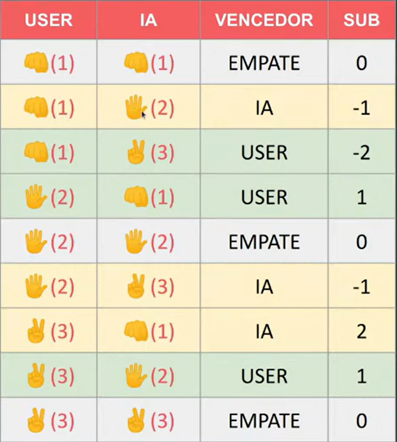

<h1 align="center"> JOGO JO-KEN-PO </h1>

Projeto desenvolvido em java junto com a Dio.me.

  <a href="#-tecnologias">Tecnologias</a>&nbsp;&nbsp;&nbsp;|&nbsp;&nbsp;&nbsp;
  <a href="#-projeto">Projeto</a>&nbsp;&nbsp;&nbsp;&nbsp;&nbsp;&nbsp;

 

  
Lógica para implementar o código de EMPATE e quem VENCEU.
Pensamento Computacional.
Reconhecimento de padrões. 

  

 

## 🚀 Tecnologias

Esse projeto foi desenvolvido com as seguintes tecnologias:

- Java
- Git e Github

 

## 💻 Projeto

Projeto feito em Java, jogo Po-Ken-Po.

 

---

Feito com ♥ by Thamyres.